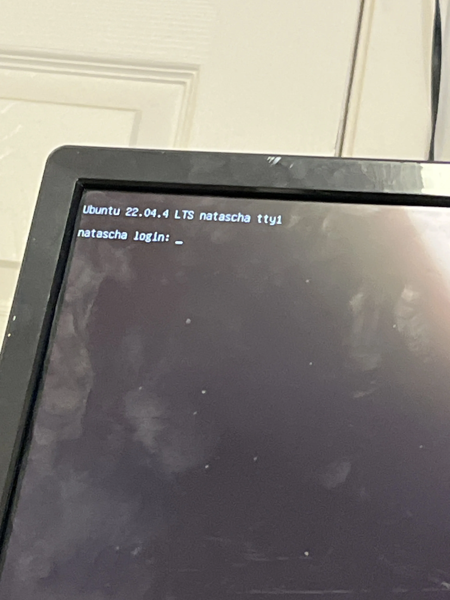
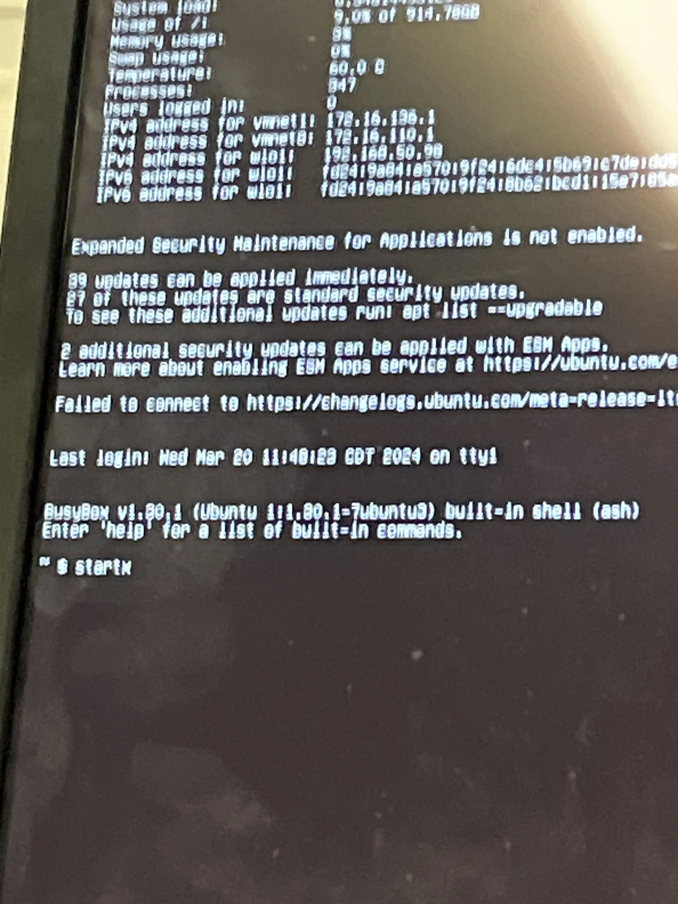
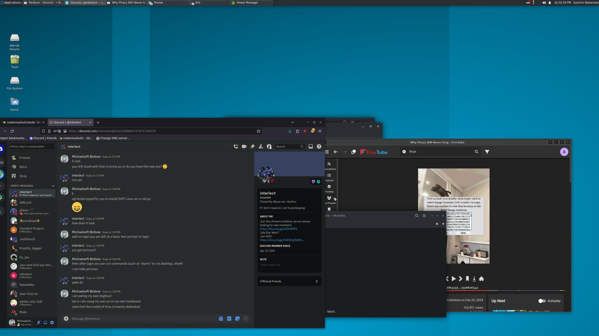

# SHIT Linux
## Sam's Heckin Intermitent Tiny Linux
### What is?

It is a distro that removes the bloat from Ubuntu, replaces curl and wget with my swirl project, does not start up with a desktop (but you can start a XFCE session after logging in by the "startx" command), does NOT come with a browser, comes with an "add-flathub.sh" script, a "scrcpy.AppImage" binary, an "install-roblox-studio.sh" script, and replaces some of the bloated GNU coreutils with BusyBox utils. Also comes with flatpak.

### Download link pls?

[Here, enjoy! :D](https://sparksammy.com/shit-linux.iso)

### IMPORTANT NOTES

* It is recommended for typical desktop use that you ***uncheck*** the LVM-related partition options in the initial install.
* You ***WILL*** need a SD Card with SD card reader ***OR*** USB Drive
* Do ***NOT*** buy SD Cards or USB Drives online.
* This only comes with the bare necessities. You'll need to provide any extra packages, such as xfce's screenshooter or power-management apps or a web browser, via apt or flatpak.
* There IS an "Additional Drivers" app to install NVIDIA drivers.
* Most WiFi drivers that are compatible with Ubuntu Jammy Jellyfish should work by default ***after*** install.
* CURL is incompatible with most applications due to it being a shortcut to the better "swirl" project 
### How to install? 

(Thanks ChatGPT for making my poor instructions more clear and interesting to read!)

Alright, buckle up! First things first, grab yourself a spare USB Drive that you’re cool with reformatting – trust me, it’s for a good cause. Next up, snag a copy of [Ventoy](https://www.ventoy.net/en/index.html) (Avoid the ADS! :+1:) and fire up Ventoy2Disk. Now, pay attention here: make sure you disable that pesky secure boot support in Ventoy2Disk. Then, it’s time to work some magic – install Ventoy onto your USB and toss that ISO onto the VENTOY partition like a pro.

Once that’s all done, it’s time to shake things up. Reboot into your BIOS – yeah, we’re diving deep now. Kick secure boot to the curb (I mean, who needs those Microsoft certs anyway, right?) and boot up from your USB. Choose that ISO you’ve been itching to install, but hold up – don’t forget to give LVM the ol’ heave-ho.

And just like that, you’re off to the races! Trust me, it’s way easier than it sounds. Time to sit back, relax, and watch your system transform before your very eyes. You got this!

### Screenshots?

Sure! Here are some screenshots!

* Description: User login prompt example

* Description: A user starting X.Org

* Description: A slightly customized desktop
