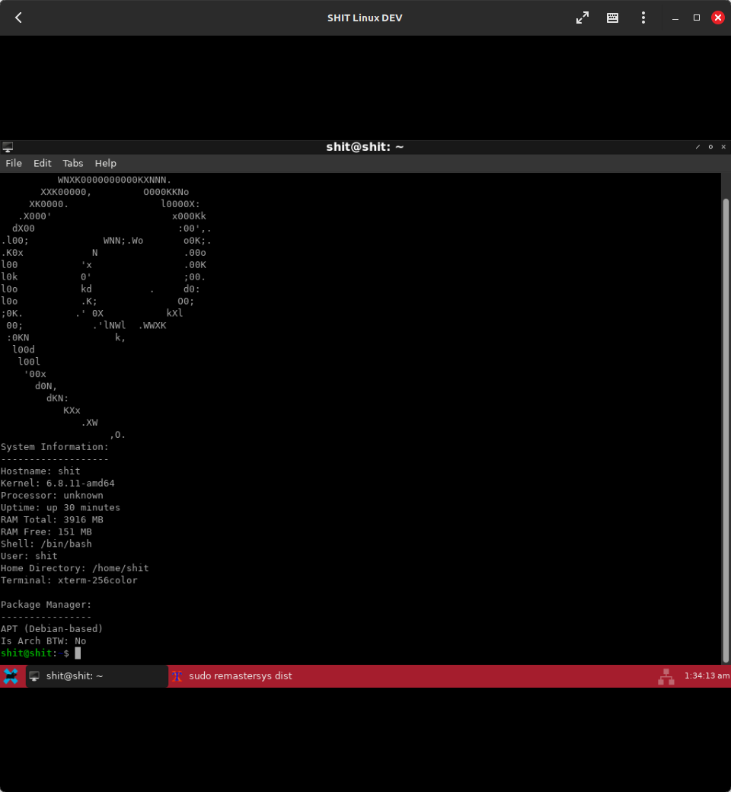

# SHIT Linux
## Sam's Heckin Intermitent Tiny Linux
### What is?

It is a distro that: comes with OpenBox, ***does*** come with a browser, comes with a "scrcpy.AppImage" binary, roblox-scrcpy script, and comes with some games, launchers, apps, and ROBLOX Studio. Also comes with flatpak.

### Download link pls?

[Here, enjoy! :D](https://1drv.ms/u/s!Ak8-fBycIqCGqMppoV3zWxPBiMZJ1g?e=AYsuoc)

### IMPORTANT NOTES

* It is recommended for typical desktop use that you ***uncheck*** the LVM-related partition options in the initial install.
* You ***WILL*** need a SD Card with SD card reader ***OR*** USB Drive
* Do ***NOT*** buy SD Cards or USB Drives online.
* Most WiFi drivers that are compatible with Debian Sid should work by default.

### How to install on a PC? 

(Thanks ChatGPT for making Mr. Lord's poor instructions more clear and interesting to read!)

Alright, buckle up! First things first, grab yourself a spare USB Drive that you’re cool with reformatting – trust me, it’s for a good cause. Next up, snag a copy of ***Ventoy*** (***[Download here](https://sourceforge.net/projects/ventoy/files/v1.0.97/ventoy-1.0.97-windows.zip/download)*** if your ***current*** OS is Windows or ***[download here](https://sourceforge.net/projects/ventoy/files/v1.0.97/ventoy-1.0.97-windows.zip/download)*** if you are on GNU/Linux.) and fire up ***Ventoy2Disk.*** ***Now, pay attention here: make sure you disable that pesky secure boot support in Ventoy2Disk. Then, it’s time to work some magic – install Ventoy onto your USB and toss that ISO onto the VENTOY partition like a pro.***

Once that’s all done, it’s time to shake things up. Reboot into your BIOS – yeah, we’re diving deep now. ***Kick secure boot to the curb (I mean, who needs those Microsoft certs anyway, right?) and boot up from your USB. Choose that ISO you’ve been itching to install.***

And just like that, you’re off to the races! Trust me, it’s way easier than it sounds. Time to sit back, relax, and watch your system transform before your very eyes. You got this!

### Screenshots?

Sure! Here are some screenshots!

* Description: A desktop using default-choice of desktop environment

### Maintainers

* Sam Sneed - Website Maintainer: Responsible for maintaining and updating the website.
* Sparksammy - Ex-Distro-Dev/Current Download Maintainer: Previously a Distro Developer, now overseeing current download maintenance.
* Maxwell Drake - Current Distro Developer: Actively involved in the development and maintenance of the distribution.
